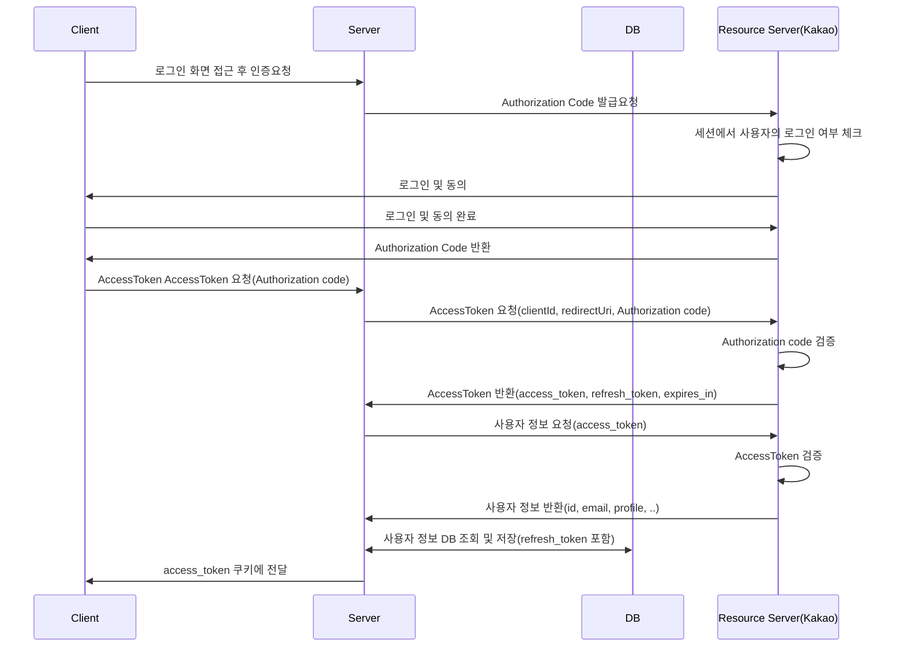
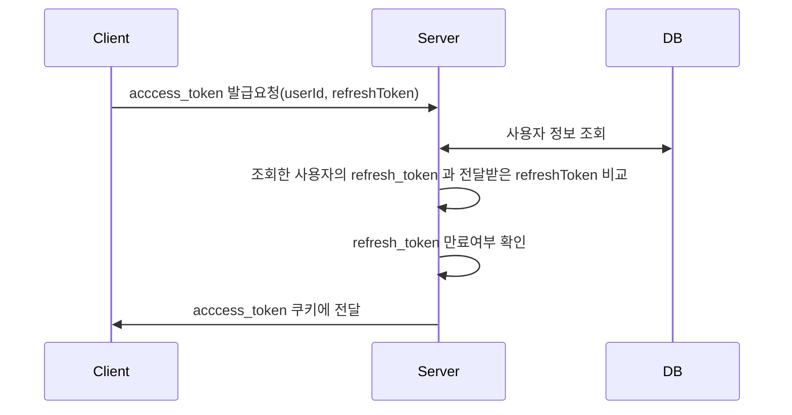

## OAuth2.0

### **1-1. 사용 스택**

SpringBoot 3.3.2 + JDK 21 + SpringSecurity + JPA + Gradle + MySQL + JWT

### **1-2. 플로우**

a. 사용자 정보 인증 요청

```mermaid

sequenceDiagram
    participant Client
    participant Server
    participant DB
    participant Resource Server(Kakao)
    Client->>Server: 로그인 화면 접근 후 인증요청 
    Server->>Resource Server(Kakao): Authorization Code 발급요청
    Resource Server(Kakao)->>Resource Server(Kakao): 세션에서 사용자의 로그인 여부 체크
    Resource Server(Kakao)->>Client : 로그인 및 동의
    Client->> Resource Server(Kakao): 로그인 및 동의 완료
    Resource Server(Kakao)->>Client: Authorization Code 반환
    Client->>Server: AccessToken AccessToken 요청(Authorization code)
    Server->>Resource Server(Kakao): AccessToken 요청(clientId, redirectUri, Authorization code)
    Resource Server(Kakao)->>Resource Server(Kakao): Authorization code 검증
    Resource Server(Kakao)->>Server: AccessToken 반환(access_token, refresh_token, expires_in)
    Server->>Resource Server(Kakao) : 사용자 정보 요청(access_token)
    Resource Server(Kakao)->>Resource Server(Kakao): AccessToken 검증
    Resource Server(Kakao)->>Server: 사용자 정보 반환(id, email, profile, ..)
    Server<<->> DB: 사용자 정보 DB 조회 및 저장(refresh_token 포함)
    Server->>Client : access_token 쿠키에 전달
```

b. JWT AccessToken 발급
    

```mermaid
sequenceDiagram
    participant Client
    participant Server
    participant DB
    Client->>Server: acccess_token 발급요청(userId, refreshToken) 
    Server<<->>DB: 사용자 정보 조회
    Server->>Server: 조회한 사용자의 refresh_token 과 전달받은 refreshToken 비교
    Server->>Server: refresh_token 만료여부 확인
    Server->>Client: acccess_token 쿠키에 전달
```
